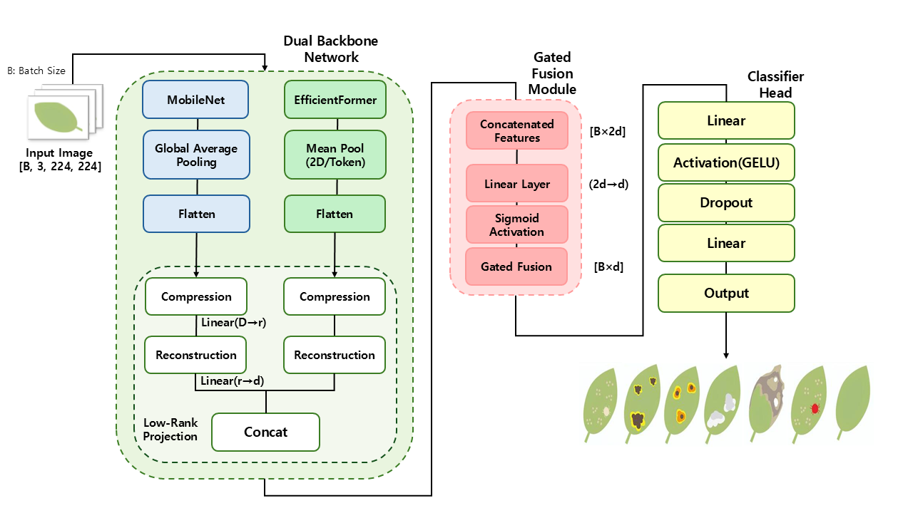

# Lightweight Dual-Backbone Framework for Tea Leaf Disease Detection

> **📢Paper Link:** [[ISCT2025-Lightweight Dual-Backbone Framework for Tea Leaf Disease Detection
]](https://ieeexplore.ieee.org/document/11297301)

---

## 📌 Introduction
Tea diseases can significantly impact crop yield and quality. To address this, we propose **TinyGFNet**, a lightweight dual-backbone framework designed for efficient and accurate tea leaf disease detection in mobile and edge computing environments.

This project implements the official code for the paper:  
**"Lightweight Dual-Backbone Framework for Tea Leaf Disease Detection"**.

<p align="center">
  
</p>

## ✨ Key Features
* **Dual-Backbone Architecture:** Combines **MobileNetV3** (Local Features) and **EfficientFormer** (Global Features) to maximize feature extraction capability.
* **Gated Fusion Module:** Effectively fuses heterogeneous features from CNN and Transformer branches using a gate mechanism.
* **Lightweight & Efficient:** Achieves state-of-the-art performance with significantly lower parameters and FLOPs compared to ViT.
  * **Parameters:** 12.88M
  * **FLOPs:** 1.34G
  * **F1-Score:** 0.95

## 📂 Project Structure
```bash
.
├── assets/                # Images for README (Model architecture, Results)
├── config/                # Configuration files
├── models/                # TinyGFNet model implementation
│   └── teaformer.py       # Main model file
├── scripts/               # Training & Inference scripts
│   ├── train.py
│   ├── inference.py
│   ├── dataset.py
│   └── ...
├── requirements.txt       # Python dependencies
└── README.md

```

## 🚀 Getting Started

### 1. Installation

Clone the repository and install dependencies.

```bash
git clone [https://github.com/pepper29/TinyGFNet.git](https://github.com/pepper29/TinyGFNet.git)
cd TinyGFNet
pip install -r requirements.txt

```

### 2. Dataset Preparation

Structure your dataset as follows:

```
data/
  ├── train/
  │   ├── class_1/
  │   ├── class_2/
  │   └── ...
  └── val/
      ├── class_1/
      └── ...

```

### 3. Training

To train the TinyGFNet model on your dataset:

```bash
python scripts/train.py --config config/config.py

```

### 4. Inference

To detect diseases from a single image:

```bash
python scripts/inference.py --image_path sample_leaf.jpg --checkpoint outputs/best_model.pth

```

## 📊 Experimental Results

| Model | Params (M) | FLOPs (G) | Accuracy |
| --- | --- | --- | --- |
| CNN | 11.24 | 1.82 | 0.92 |
| ViT | 86.00 | 12.02 | 0.95 |
| MobileNetV3 | 0.70 | 0.02 | 0.80 |
| **TinyGFNet (Ours)** | **12.88** | **1.34** | **0.95** |

<p align="center">

</p>


## 📝 License

This project is licensed under the MIT License.

```
